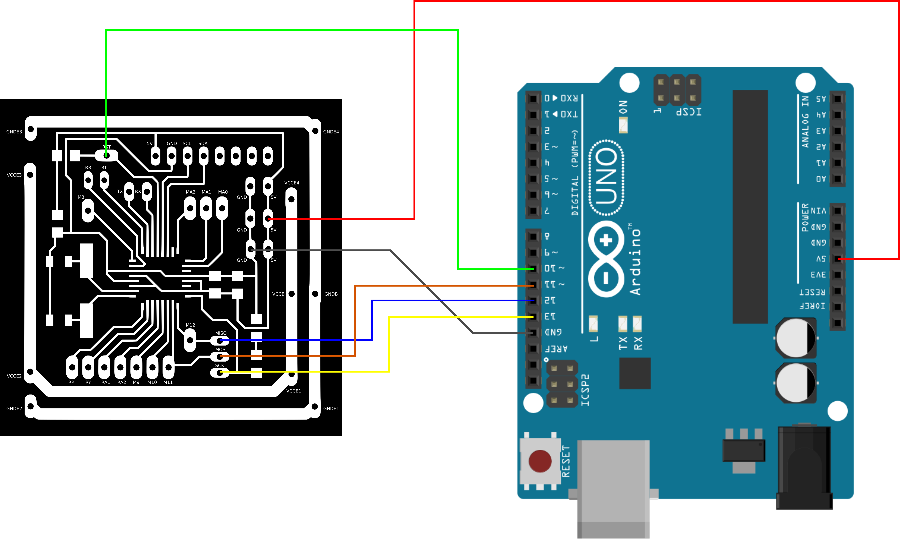
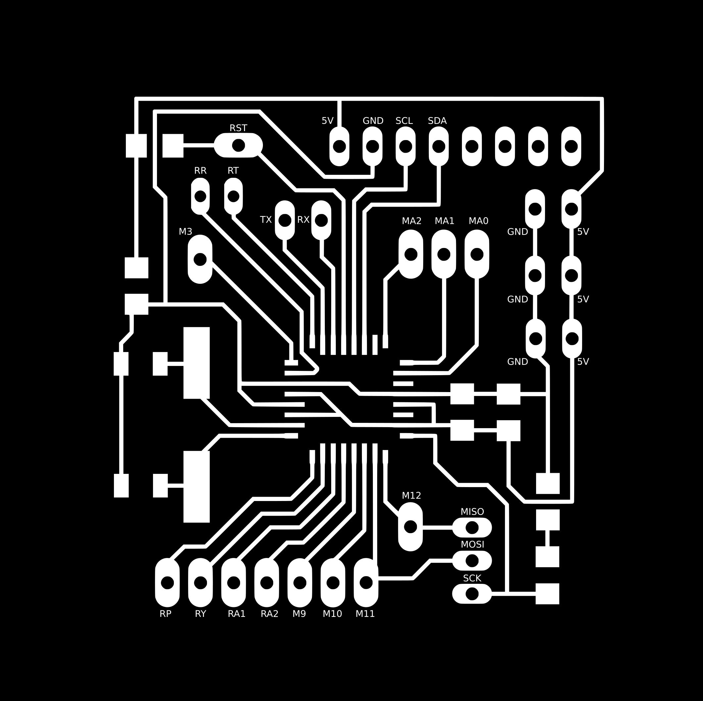
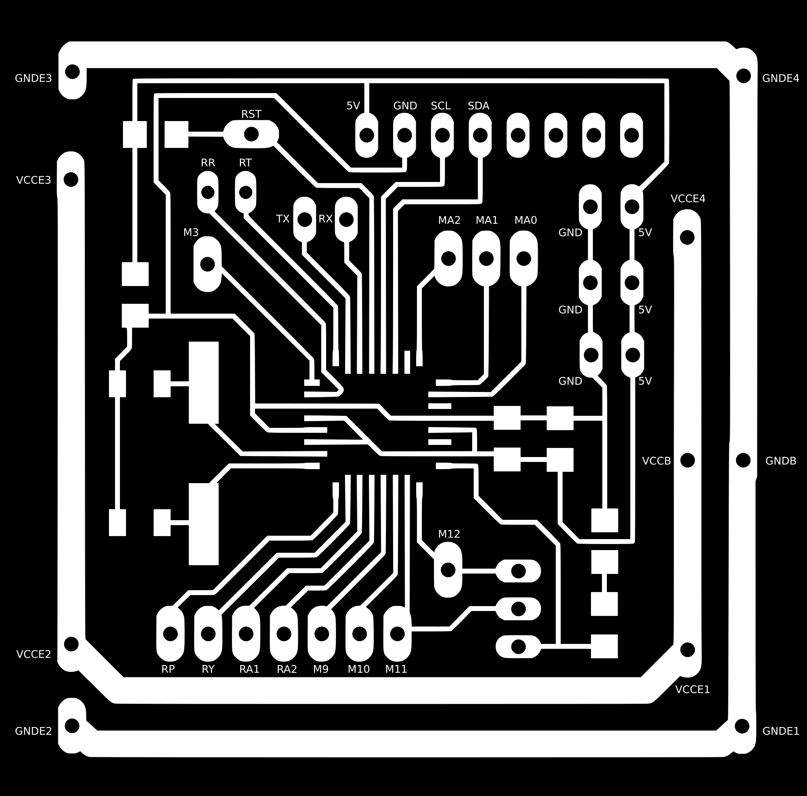
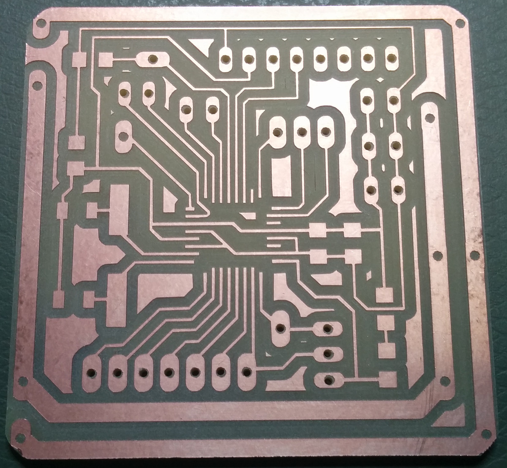
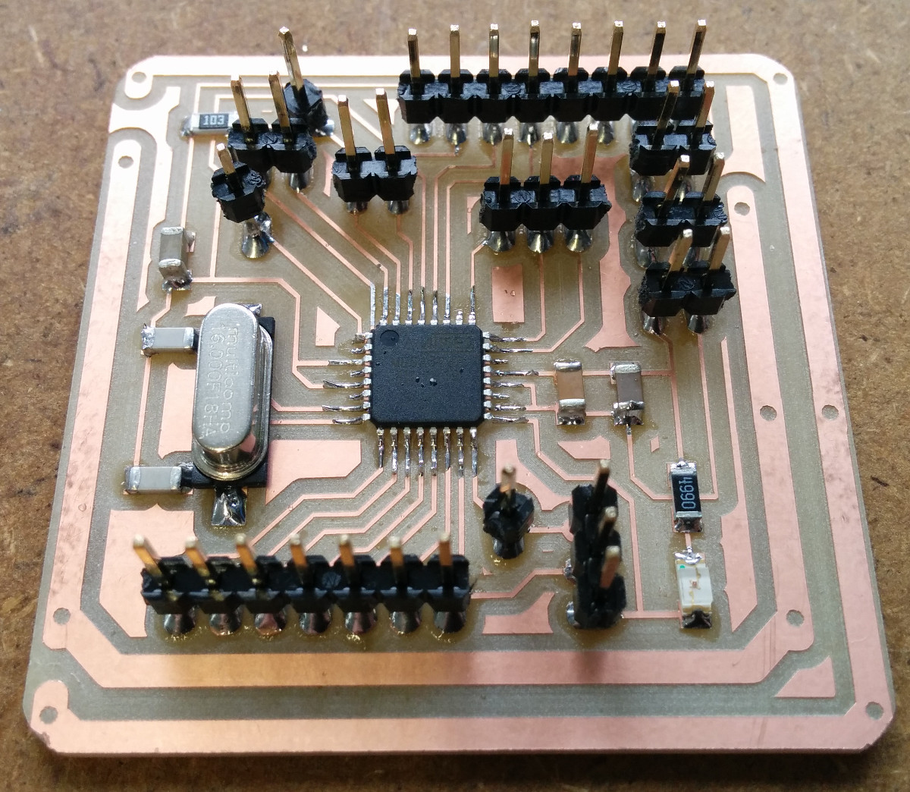
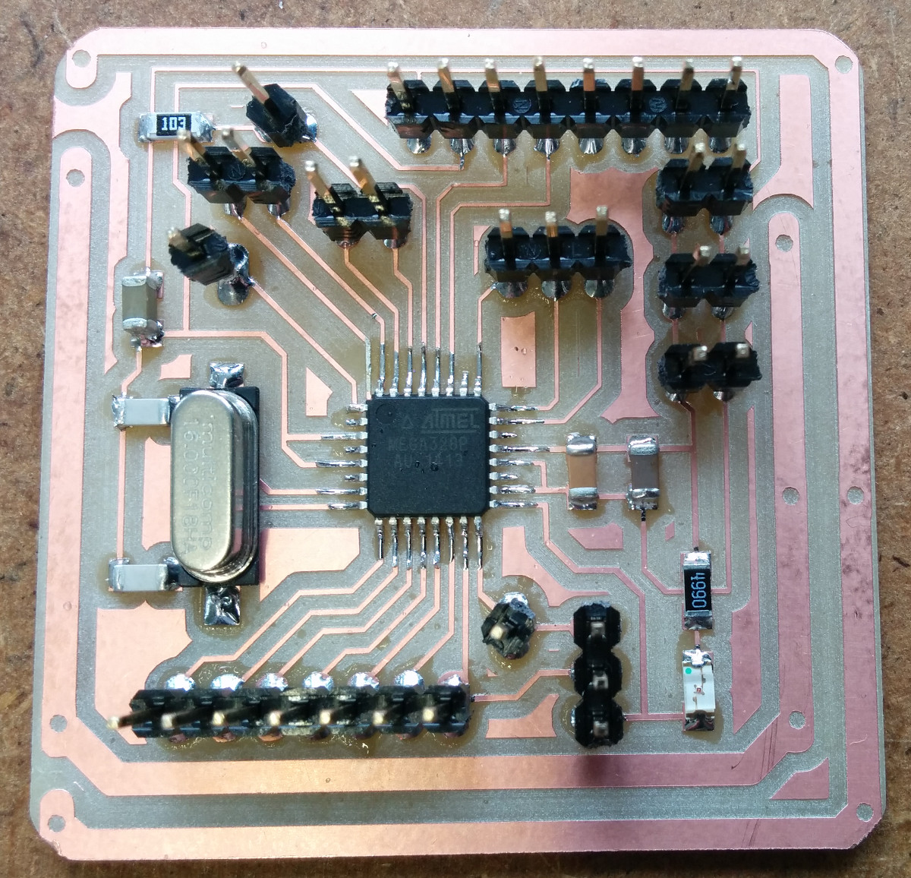
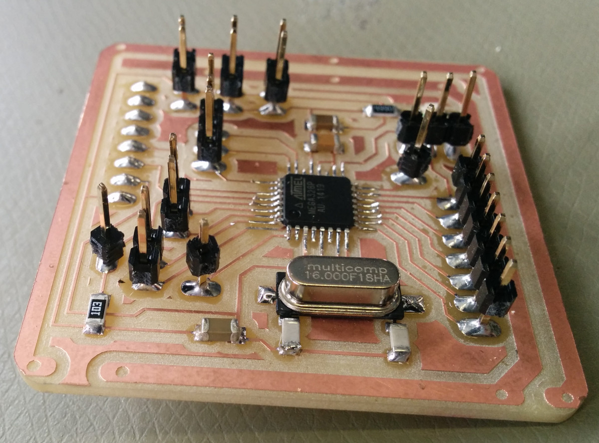
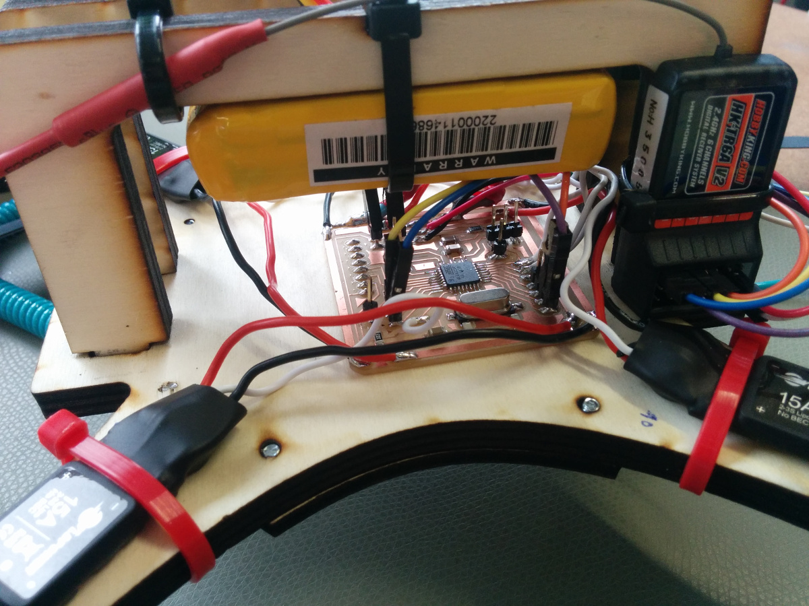

<h1 style="font-family: courier;" align="center"> satshakit flight controller</h1>

<i>An open source & easy to make flight controller board.</i>

  

satshakit flight controller
--
satshakit flight controller is an **open source, MultiWii compatible, flight controller board**, that is possibile to **make in a FabLab**. The design derives from both a **satshakit board** and dual processor flight controller of my **[FabAcademy2015 final project](http://fabacademy.org/archives/2015/eu/students/ingrassia.daniele/index.html)**.

Here you can find all of the satshakit boards: **[satshakit organization](https://github.com/satshakit)**.

Features
--

satshakit flight controller has been designed aiming to be **easy to make, program and use**, so to be possible to **replicate and customize it** in any other Fab Lab. It has the following features:

- support for [any drone configuration](http://www.multiwii.com/connecting-elements) up to **8 motors**
- support for up to **6 channels** receivers 
- costs about **8€**
- **16mhz crystal** for precise clock, reliability and compatibility
- size of **48x48mmm** to fit the size of commercial available boards
- embedded **power board** (if needed)
- possibility to connect and use **any IMU working at 5V**

You can use satshakit flight controller in **DIY drones** or, due the dimensions are the same or less of most of the MultiWii commercial flight controller boards (50x50mmm), as a **replacement flight controller for commercial drones**. For drones up to 4 motors and 15A ESCs, is possible to use the **embedded power board**, otherwise is recommended to use an external power board, and to make the satshakit flight controller without the power board embedded.

Getting started
--

After you finish to solder a satshakit flight controller board, you need to **set its fuses and to program it with MultiWii**. To set the fuses you can easily upload the Arduino Bootloader using Arduino IDE and an **Arduino as ISP**. To do so first upload the Arduino as ISP sketch into an Arduino, and then connect the satshakit flight controller as following (this is the same for the version with the power board and without):

Once everything is connected, follow these steps to upload Arduino bootloader:

1. open Arduino IDE
2. select proper programmer (for example Arduino as ISP or USBtinyISP)
3. select Arduino UNO as board
4. click on tools->Burn Bootloader

Now you can use again the same connections, Arduino as ISP and Arduino IDE  to **upload your favourite MultiWii** version, this time using **File->Upload using a programmer**.

To connect all the elements fo your drone, you can follow the **satshakit flight controller pinout**:

satshakit flight controller pinout with **embedded power power board:**

Downloads
--

**downloads (right click, download as)**

- [satshakit flight controller sch](https://raw.githubusercontent.com/satshakit/satshakit-flight-controller/master/eagle_projects/satshakit_flight_controller/satshakit_fc.sch)
- [satshakit flight controller brd](https://raw.githubusercontent.com/satshakit/satshakit-flight-controller/master/eagle_projects/satshakit_flight_controller/satshakit_fc.brd)
- [satshakit flight controller svg](https://raw.githubusercontent.com/satshakit/satshakit-flight-controller/master/media/satshakit_flight_controller/satshakit_fc.svg)
- [satshakit flight controller internal](https://raw.githubusercontent.com/satshakit/satshakit-flight-controller/master/media/satshakit_flight_controller/satshakit_fc_internal.png)
- [satshakit flight controller holes](https://raw.githubusercontent.com/satshakit/satshakit-flight-controller/master/media/satshakit_flight_controller/satshakit_fc_holes.png)
- [satshakit flight controller cut](https://raw.githubusercontent.com/satshakit/satshakit-flight-controller/master/media/satshakit_flight_controller/satshakit_fc_cut.png)
- [satshakit flight controller cut tip](https://raw.githubusercontent.com/satshakit/satshakit-flight-controller/master/media/satshakit_flight_controller/satshakit_fc_cut_tip.png)
- [satshakit flight controller with power board sch](https://raw.githubusercontent.com/satshakit/satshakit-flight-controller/master/eagle_projects/satshakit_flight_controller_power/satshakit_fc_power.sch)
- [satshakit flight controller with power board brd](https://raw.githubusercontent.com/satshakit/satshakit-flight-controller/master/eagle_projects/satshakit_flight_controller_power/satshakit_fc_power.brd)
- [satshakit flight controller with power board svg](https://raw.githubusercontent.com/satshakit/satshakit-flight-controller/master/media/satshakit_flight_controller_power/satshakit_fc_power.svg)
- [satshakit flight controller with power board internal](https://raw.githubusercontent.com/satshakit/satshakit-flight-controller/master/media/satshakit_flight_controller_power/satshakit_fc_power_internal.png)
- [satshakit flight controller with power board holes](https://raw.githubusercontent.com/satshakit/satshakit-flight-controller/master/media/satshakit_flight_controller_power/satshakit_fc_power_holes.png)
- [satshakit flight controller with power board cut](https://raw.githubusercontent.com/satshakit/satshakit-flight-controller/master/media/satshakit_flight_controller_power/satshakit_fc_power_cut.png)
- [satshakit flight controller with power board cut tip](https://raw.githubusercontent.com/satshakit/satshakit-flight-controller/master/media/satshakit_flight_controller_power/satshakit_fc_power_cut_tip.png)
- [satshakit flight controller BOM xlsx](https://raw.githubusercontent.com/satshakit/satshakit-flight-controller/master/docs/satshakit_fc_BOM.xlsx)
- [satshakit flight controller BOM ods](https://raw.githubusercontent.com/satshakit/satshakit-flight-controller/master/docs/satshakit_fc_BOM.ods)

Media
--

board, soldered and installed satshakit flight controller:

uploading Arduino bootloader:

uploading Multiwii:

Multiwii test:

What's in the repo
--

- **[docs](https://github.com/satshakit/satshakit-flight-controller/tree/master/docs)**: BOM files for Farnell
- **[egle projects](https://github.com/satshakit/satshakit-flight-controller/tree/master/eagle_projects)**: eagle projects of the satshakit flight controller
- **[media](https://github.com/satshakit/satshakit-flight-controller/tree/master/media)**: svgs, connections schemas, images for cnc milling machine, other images

Authors
--

- Daniele Ingrassia

Contact
--

- **ingrassiada@gmail.com**
- **[linkedin](http://it.linkedin.com/in/danieleingrassia)**

Thanks
--

[Fablab Kamp-Lintfort](http://fablab.hochschule-rhein-waal.de/index.php/de/) 
Hochschule Rhein-Waal 
Friedrich-Heinrich-Allee 25, 47475 Kamp-Lintfort, Germany 
fablab@hochschule-rhein-waal.de

License
--
This work is licensed under the terms of the open source license: Creative Commons Attribution-ShareAlike 4.0 International ([CC BY-SA 4.0](https://creativecommons.org/licenses/by-sa/4.0/)).

Disclaimer  
--

This hardware/software is provided "as is", and you use the hardware/software at your own risk. Under no circumstances shall any author be liable for direct, indirect, special, incidental, or consequential damages resulting from the use, misuse, or inability to use this hardware/software, even if the authors have been advised of the possibility of such damages.

